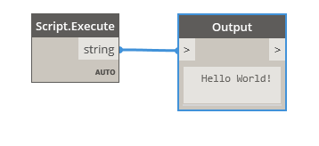
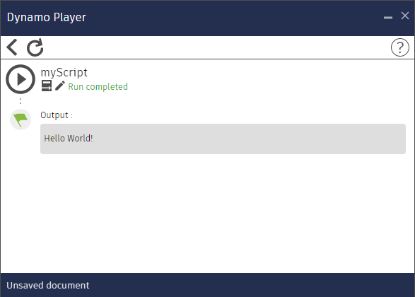

# pyScript
Simple Zero Touch Node to run python scripts in a dynamo player (http://dynamobim.org).
- The `Script.Execute` node finds a python file with the same name as the dynamo file and launches it.
- Prints and errors are available for viewing from the dynamo player.
- The current folder is added to the search paths.
- To create a new script, you do not need to open dynamo: just copy any pair of <script name>.dyn / <script name>.py

